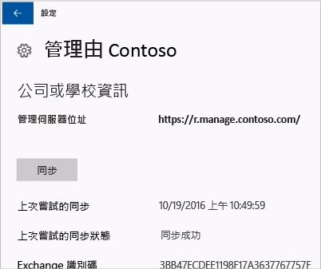
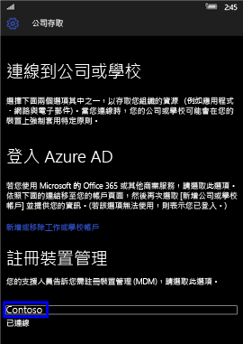
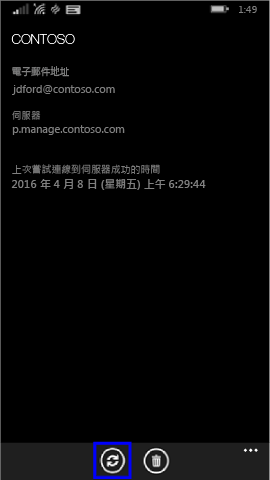

# 手動同步處理您的 Windows 裝置

有時嘗試在 Windows 裝置上安裝應用程式，所花的時間比您以為的長。 如果發生這種情況，您可以嘗試手動同步處理您的 Windows 裝置。 同步處理有助於加速安裝。

> [!Note]
> 如果您使用的網路速度較慢，或同時下載內容的裝置數量較多，安裝應用程式可能需時較長。

下列 Windows 版本可以手動同步處理。 如果您的裝置不幸使用不同版本的 Windows，就無法啟動手動同步處理。

* [同步處理 Windows 10 桌面](#windows-10-desktop)
* [同步處理 Windows 10 Mobile](#windows-10-mobile)
* [同步處理 Windows Phone 8.1](#windows-phone-81)

## Windows 10 Desktop
有多個版本的 Windows 10，因此有兩組步驟。 若要找出要使用的步驟，請查看螢幕擷取畫面，然後依照您在裝置上看到的步驟。

1. 選擇 [啟動] 按鈕，然後選擇 [設定]。

    ![[啟動] 按鈕](./media/win10pc-sync-1-start-button.png)

2. 在 [設定] 頁面上，選擇 [帳戶]。

    ![選擇 [設定] 頁面上的帳戶](./media/win10pc-sync-2-settings-accounts.png)

3. 查看接下來的兩個畫面，並找出其中看起來像在您裝置上所看到的畫面。 遵循您在裝置上看見的畫面中所顯示的步驟。

    如果您看到這個顯示 [存取公司或學校資源] 的畫面，請遵循[如果看見 [存取公司或學校資源] 時需遵循的步驟](#steps-to-follow-if-you-see-access-work-or-school)中的指示。

    ![如果看見 [存取公司或學校資源] 時需遵循的同步步驟](./media/w10-enroll-rs1-connect-to-work-or-school.png)

    如果您看到這個顯示 [公司存取] 的畫面，請遵循[如果看見 [公司存取] 時需遵循的步驟](#steps-to-follow-if-you-see-work-access)中的步驟。

    ![選擇 [公司存取] 作為帳戶類型](./media/win10pc-sync-3-work-access.png)

### 如果看見 [存取公司或學校資源] 時需遵循的步驟

1. 在 [帳戶] 頁面上，選擇 [存取公司或學校資源]。

    ![選擇 [存取公司或學校資源]](./media/w10-enroll-rs1-connect-to-work-or-school.png)

2. 選擇工作或學校帳戶。 根據公司支援人員設定項目的方式，您可能會看到兩個帳戶，其與下列所示的範例類似。 其中一個帳戶旁邊會有公事包，另一個帳戶旁邊則會有 Microsoft 標誌。

   - 如果您看到具有公事包的帳戶，請選取它，並尋找其下的 [資訊] 按鈕。
   - 如果您看到具有 Microsoft 標誌的帳戶，請選取該帳戶，並尋找其下的 [資訊] 按鈕。

     

3. 選擇 [資訊] 按鈕。 隨即開啟與下面範例類似的對話方塊。

    

4. 選擇 [同步] 按鈕。 您的裝置將與 Intune 同步。

### 如果看見 [公司存取] 時需遵循的步驟

1. 在 [帳戶] 頁面上，選擇 [公司存取]。

    ![選擇 [公司存取] 作為帳戶類型](./media/win10pc-sync-3-work-access.png)

2. 在 [註冊裝置管理] 區段下方，選擇您的公司名稱。

    

3. 選擇 [同步] 按鈕。

    ![選擇 [同步] 按鈕](./media/win10pc-sync-5-tap-sync.png)

   按鈕會變成灰色，直到同步完成為止。

### Windows 10 Mobile
手動同步處理您的 Windows 10 Mobile 裝置來加速緩慢的應用程式安裝：

   1. 移至 [所有應用程式] > [設定] > [帳戶]。

       ![選擇 [設定] 畫面上的帳戶](./media/win10m-sync-1-settings-accounts.png)

   2. 選擇 [公司存取]。

       ![選擇 [公司存取] 作為帳戶類型](./media/win10m-sync-2-work-access.png)

   3. 在 [註冊裝置管理] 下方，選擇您的公司名稱。

       

   4. 選擇**同步**圖示。

       

       「我們正在同步您的帳戶」訊息會顯示在畫面頂端。 [同步] 按鈕會呈現灰色，直到您的裝置完成同步為止。

## Windows Phone 8.1
手動同步處理您的 Windows Phone 8.1 裝置來加速緩慢的應用程式安裝：

1. 移至 [所有應用程式] > [設定] > [工作場所]。

    

2. 選擇您的公司名稱。

    

3. 選擇**同步**圖示。

    

   「我們正在同步您的帳戶」訊息會顯示在畫面頂端，直到您的裝置完成同步為止。

是否仍需要協助？ 請連絡您公司的支援人員。 如需連絡資訊，請查看[公司入口網站](https://portal.manage.microsoft.com#HelpDeskDialog)。
